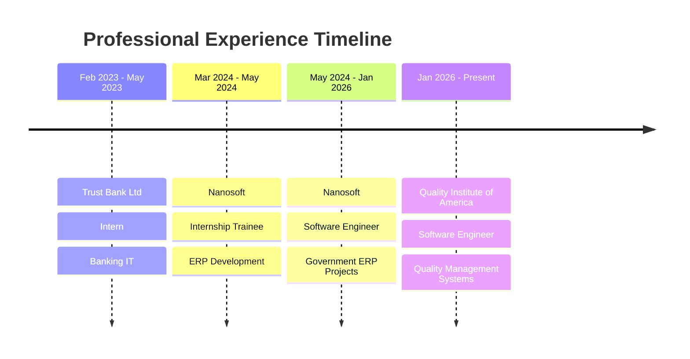

<div align="center">

# 👨‍💻 Rizve Ahmad

[](https://git.io/typing-svg)

### Building Enterprise-Grade Solutions with .NET

[](https://www.linkedin.com/in/1503-rizve)
[](https://github.com/Rizve1503)
[](mailto:rizverizu1999@gmail.com)
[](https://github.com/Rizve1503)

</div>

---

## 🎯 About Me

> **Software Engineer** passionate about building scalable enterprise solutions with **.NET 8**, **Clean Architecture**, and modern development practices.

- 💼 **Current Role:** Software Engineer @ **Quality Institute of America (QIA)**
- 🎓 **Education:** B.Sc. in CSE - Northern University Bangladesh
- 📍 **Location:** Dhaka, Bangladesh 🇧🇩
- 💡 **Experience:** 2.5+ years | 3 companies | 12+ projects delivered
- 🎯 **Focus:** Quality Management Systems, ERP Solutions, Clean Architecture
- 🌱 **Learning:** Advanced .NET patterns, Microservices, Cloud Architecture
- 🔭 **Industries:** Consulting, Government, Banking
- ⚡ **Philosophy:** *"Clean code, scalable architecture, continuous learning"*

---

## 💼 Current Role

<div align="center">

### 🏢 Software Engineer @ Quality Institute of America (QIA)
**January 2026 - Present**

*Building enterprise solutions for quality management and consulting*

</div>

**🎯 Focus Areas:**
- 🏗️ Enterprise web applications with **.NET 8** & **ASP.NET Core MVC**
- 🎨 Full-stack features: **Bootstrap 5**, **jQuery**, **SignalR**
- 🏛️ **4-layer Clean Architecture** (Web → Service → Core → Infrastructure)
- ☁️ **Azure DevOps** workflows, testing, and code reviews

**🛠️ Tech Stack:** `.NET 8` `ASP.NET Core MVC` `C#` `SQL Server` `SignalR` `Bootstrap 5` `jQuery` `Azure DevOps`

---

## 🛠️ Tech Stack

<div align="center">

### Backend & Core


### Database & ORM


### Frontend


### Cloud & DevOps


### Tools & IDEs


</div>

---

## 🏆 Core Competencies & Achievements

<table>
<tr>
<td width="50%" valign="top">

### 💡 Technical Expertise

- ✅ **Clean Architecture** - 4-layer separation
- ✅ **SOLID Principles** - Quality code standards
- ✅ **Design Patterns** - Scalable solutions
- ✅ **RESTful APIs** - Well-designed endpoints
- ✅ **Database Design** - Optimized schemas
- ✅ **Real-time Apps** - SignalR implementation
- ✅ **Cloud Deployment** - Azure services

</td>
<td width="50%" valign="top">

### 🎯 Career Highlights

- 🚀 **12+ Projects** successfully delivered
- 🏢 **3 Companies** across multiple sectors
- 👥 **4 Major ERP Modules** architected & led
- 📊 **1000s of Users** impacted by systems
- 🎓 **2 Certifications** (C#, Trust Bank)
- ⭐ **9 GitHub Stars** on open-source work
- 💻 **18 Public Repositories** maintained

</td>
</tr>
</table>

---

## 📊 GitHub Statistics

<div align="center">

<a href="https://github.com/Rizve1503">
  
  
</a>


</div>

---

## 💼 Professional Experience

### 🏛️ Featured Projects

<table>
<tr>
<td width="50%" valign="top">

#### 🏢 SDF ERP System
**Social Development Foundation (Government)**

Large-scale ERP with 4 modules:

- 👥 **HR & Payroll** - Gratuity, PF, Payroll systems
- 📋 **Operations** - Leave, Attendance, Inventory
- 📊 **Project Mgmt** - Online Appraisal system
- 📈 **Reporting** - Custom RDLC reports

**Tech:** `.NET 8` `ASP.NET Core` `EF Core` `SQL Server` `RDLC` `Azure`

**Impact:** Government system serving 1000s of employees

</td>
<td width="50%" valign="top">

#### 🏥 DSK MIS
**Dushtha Shasthya Kendra (Healthcare NGO)**

Healthcare management system:

- 💰 **Donor Tracking** - Donation management
- 💵 **Expenditure** - Project budget tracking
- 📊 **Impact Analytics** - Outcome monitoring
- 📋 **Reporting** - Financial & operational reports

**Tech:** `.NET Core` `Web API` `SQL Server` `Entity Framework`

**Impact:** Healthcare NGO operations management

</td>
</tr>
</table>

---

## 🚀 Personal Projects

<details open>
<summary><b>📦 Inventory Management System</b> - Clean Architecture showcase</summary>

<br>

[](https://github.com/Rizve1503/InventoryManagement)
[](https://github.com/Rizve1503/InventoryManagement/stargazers)

**Production-grade inventory management with customizable templates**

**Features:**
- ✨ Custom field engine for flexible item properties
- 🔢 Dynamic ID format generation
- 📊 Real-time inventory tracking
- 🏷️ Advanced category management
- 🔍 Powerful search & filtering
- 🏗️ Clean Architecture implementation

**Stack:** `.NET 8` `ASP.NET Core MVC` `EF Core` `SQL Server` `Clean Architecture`

</details>

<details>
<summary><b>👤 UserNova</b> - Secure user management system</summary>

<br>

[](https://github.com/Rizve1503/UserManagement.WebApp)
[](https://github.com/Rizve1503/UserManagement.WebApp/stargazers)

**Full-stack authentication & authorization platform**

**Features:**
- 🔐 Secure authentication & authorization
- 👨‍💼 Admin panel for user management
- 📧 Database-level email uniqueness
- 🎭 Role-based access control (RBAC)
- 🔒 Password encryption & security
- 📝 User activity logging

**Stack:** `ASP.NET Core` `Entity Framework` `SQL Server` `Identity Framework`

</details>

<details>
<summary><b>💰 Mini Account Management</b> - Database-first financial system</summary>

<br>

[](https://github.com/Rizve1503/MiniAccountManagementSystem)

**Stored-procedure driven accounting system**

**Features:**
- 💵 Financial transaction management
- 📊 Account balance tracking
- 🗄️ Optimized stored procedures
- 📜 Complete transaction history
- 📈 Financial report generation
- ⚖️ Double-entry bookkeeping

**Stack:** `ASP.NET Core` `Razor Pages` `SQL Server` `Stored Procedures` `T-SQL`

</details>

<details>
<summary><b>📚 Book Data Generator</b> - Test data generation tool</summary>

<br>

[](https://github.com/Rizve1503/BookDataGenerator)
[](https://github.com/Rizve1503/BookDataGenerator/stargazers)

**Generate realistic book data for testing**

**Features:**
- 📖 Realistic data generation algorithms
- 🌍 Multi-language localization support
- 🔢 Bulk data creation capabilities
- 📤 Multiple export formats
- 🎯 Customizable data patterns
- 🔌 API integration ready

**Stack:** `.NET` `JavaScript` `SQL Server` `Web API`

</details>

<details>
<summary><b>🎲 Non-Transitive Dice Game</b> - Cryptographic game theory</summary>

<br>

[](https://github.com/Rizve1503/NonTransitiveDiceGame)
[](https://github.com/Rizve1503/NonTransitiveDiceGame/stargazers)

**Provably fair game with cryptographic randomness**

**Features:**
- 🔐 Cryptographic HMAC verification
- 🎮 Game theory implementation
- ⚖️ Provably fair mechanics
- 💻 Interactive console interface
- 📊 Probability calculations
- ✅ Transparent verification system

**Stack:** `C#` `Cryptography` `.NET Core` `HMAC-SHA256`

</details>

<details>
<summary><b>👔 Intern Management System</b> - HR lifecycle platform</summary>

<br>

[](https://github.com/Rizve1503/Intern_Management_System)

**Comprehensive intern management solution**

**Features:**
- 👤 Complete intern profile management
- 📅 Automated attendance tracking
- ⭐ Performance evaluation system
- 📋 Task assignment & tracking
- 📊 Interactive reporting dashboard
- 📁 Document management system

**Stack:** `HTML5` `CSS3` `JavaScript` `.NET` `SQL Server`

</details>

---

## 🎓 Education & Certifications

<table>
<tr>
<td width="60%" valign="top">

### 📚 Education

**Bachelor of Science in Computer Science & Engineering**  
🏫 Northern University Bangladesh  
📅 January 2020 - January 2024  
🎯 Focus: Software Engineering, Database Systems, Web Development

</td>
<td width="40%" valign="top">

### 🏆 Certifications

✅ **Commercial Software Development - C#**  
   *Itransition*

✅ **Internship Certificate**  
   *Trust Bank Limited*

</td>
</tr>
</table>

---

## 💼 Career Journey



---

## 📈 GitHub Activity

<div align="center">

[](https://github.com/Rizve1503)

</div>

---

## 🏅 GitHub Achievements

<div align="center">

[](https://github.com/Rizve1503)

</div>

---

## 🌟 What I'm Currently Working On

<div align="center">

| Focus Area | Description |
|------------|-------------|
| 🏢 **QIA Systems** | Building quality management enterprise solutions |
| 🏗️ **Clean Architecture** | Implementing 4-layer architectural patterns |
| ⚡ **Real-time Features** | Working with SignalR for live updates |
| 🗄️ **Performance** | Optimizing queries with Dapper & stored procedures |
| ☁️ **Azure DevOps** | Managing CI/CD pipelines and deployments |

</div>

---

## 💬 Let's Connect!

<div align="center">

### I'm always open to interesting conversations and opportunities!

**💼 Professional Discussions** | **🤝 Collaboration** | **🎯 Technical Consulting** | **📚 Knowledge Sharing**

<br>

[](mailto:rizverizu1999@gmail.com)
[](https://www.linkedin.com/in/1503-rizve)
[](tel:+8801316967805)

</div>

---

<div align="center">

### 📊 Profile Analytics


### ⚡ Fun Fact

```javascript
const rizveLife = () => {
    while (alive) {
        eat();
        sleep();
        code();
        repeat();
    }
};

// Debugging: The art of being the detective in a crime you committed! 🕵️‍♂️
```

---

### 💙 Thanks for visiting! Feel free to explore my repositories.


**⭐ If you find my work interesting, consider giving a star to my repositories!**

</div>
